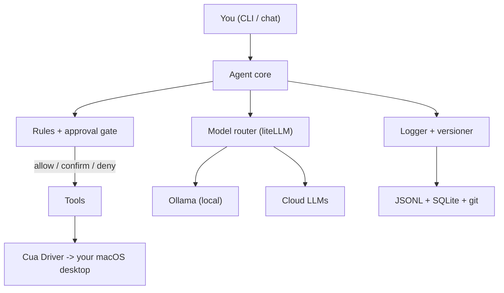

# Second Brain — Personal Computer-Control Agent

Phase 1 of a personal AI operating system: an **integrate-first, open-source agent that sees and drives your real Mac in the background**, routes tasks across **local + cloud LLMs** with head-to-head evaluation, and **logs and versions everything** under a small core you own.

This is the protected foundation. Later phases (knowledge base, scheduling, messaging, voice, n8n) plug into the same core via **MCP**.

## What it does today (Phase 1)

- **Host control with guardrails** — drives your actual desktop apps via `cua-agent` + the **Cua Driver** (background; does not steal your cursor or focus). Every proposed action passes through an **approval gate** first.
- **Multi-LLM routing + evaluation** — one interface to local (Ollama) and cloud (Claude/GPT/Groq/DeepSeek/Qwen/Gemini) models via liteLLM. Run the *same task across models* and rank them.
- **Per-task rules** — YAML rule files define instructions, allow/deny lists, and what counts as destructive. Fork bombs and credential paths are hard-blocked; deletes/sends/`sudo` require confirmation.
- **Everything logged + versioned** — each run is a JSONL trajectory, indexed in SQLite, and **auto-committed to git** so any run can be replayed and understood afterward.
- **Plan-only fallback** — with no control tooling or API keys installed, the whole pipeline still runs (the model produces a plan; nothing executes), so you can try it instantly.

## Architecture



## Quick start

```bash
# 0. On any machine, check what's needed first (stdlib only, no install required)
python3 scripts/check_system.py        # add --json for machine-readable, --install to auto-install

# Instant try (plan-only, no keys needed)
python3 -m venv .venv && source .venv/bin/activate
pip install -e .
brain doctor
brain run-task "open Notes and write a hello note" --dry-run

# Full host control + local models (macOS, Python >= 3.11)
bash scripts/setup.sh                  # runs the system check, then installs what's right for this box
# then grant Accessibility + Screen Recording to your terminal/IDE
brain doctor
```

### Running on a different machine

`scripts/check_system.py` is dependency-free and portable (macOS / Linux / Windows). Copy the repo (or just that file) to a new box and run it before installing anything. It detects OS, CPU/RAM, Python version, installed tools (git, Ollama, node, docker...), running services, and cloud keys, then prints prioritized, copy-pasteable install steps tailored to that machine (e.g. which local models its RAM can handle, whether host control is supported). Once the package is installed, the same report is available as `brain check`.

## Usage

```bash
brain check                          # portable system check + install recommendations
brain doctor                         # environment check
brain models                         # list model registry + availability
brain run-task "..."                 # run a task (gated, logged, versioned)
brain run-task "..." -m cloud-claude # pick a model
brain run-task "..." -r destructive  # use a stricter rule set
brain run-task "..." --dry-run       # plan + log only, never execute
brain chat                           # interactive task loop
brain eval "..." --models local-vision,cloud-claude --judge cloud-gpt
brain runs                           # recent versioned runs
brain ui                             # optional Gradio chat UI
```

## Configuration

- `config.yaml` (optional, project root) overrides the packaged defaults in `secondbrain/default_config.yaml` — model registry, default model, control backend (`cua` or `none`), and safety switches.
- `.env` (copy from `.env.example`) holds cloud API keys. Local models need none.
- `rules/*.yaml` define per-task policy. `default.yaml` applies to every task; pass `--rules <name>` to layer another on top.

### Safety model

- The agent works in the **background** (Cua Driver), so it can't hijack your live session.
- Destructive actions (deletes, `sudo`, sends, payments, installs) require **explicit confirmation**; a deny-list hard-blocks the truly dangerous.
- Actions are **logged before execution** and git-committed, so every run is auditable and replayable. Set `--dry-run` (or `safety.dry_run: true`) for plan-only.

## Requirements

- macOS on Apple Silicon (host control). Plan-only mode is cross-platform.
- Python >= 3.11 for `cua` host control (>= 3.9 for plan-only / eval).
- Optional: Ollama for local models; cloud API keys for cloud models.

## Project layout

- `secondbrain/` — the core package (config, models, rules, logging, core, eval, cli).
- `secondbrain/control_cua.py` — the single seam to `cua` host control.
- `rules/` — per-task policy files.
- `mcp/servers.json` — MCP server registry (the extensibility backbone).
- `logs/` — versioned run trajectories.
- `scripts/check_system.py` — portable, dependency-free system check + recommendations (run on any machine).
- `scripts/setup.sh` — one-time host setup (runs the check first).
- `docs/EXTENDING.md` — how to add tools/phases without touching the core.

## Roadmap

- **Phase 2 — Second brain:** notes + hashtag graph, YouTube/article summaries, chat with your knowledge (vector search MCP).
- **Phase 3 — Tasks & scheduling:** todos from conversations; meetings with location/time/travel (calendar + maps MCP).
- **Phase 4 — Messaging:** Telegram/Slack/etc. as channels.
- **Phase 5 — Voice + n8n + public extensibility.**

See [docs/EXTENDING.md](docs/EXTENDING.md) for how each plugs into the core.

## License

MIT.
